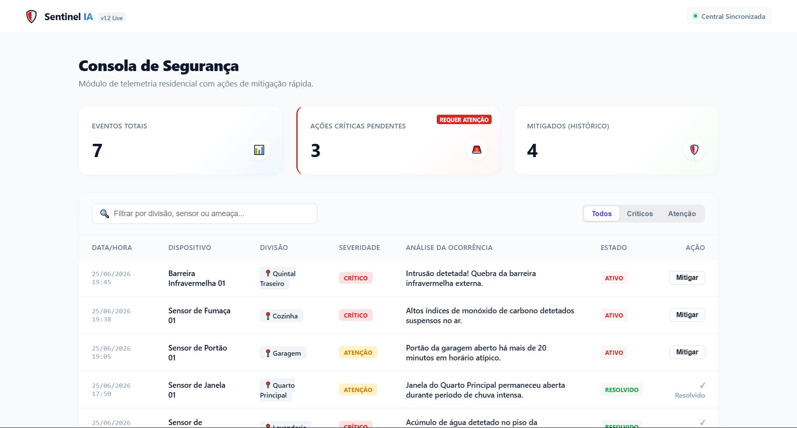
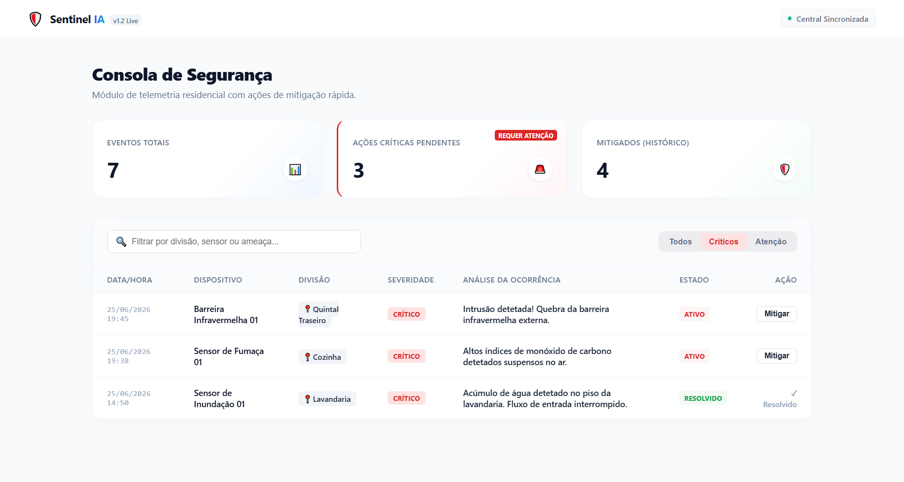
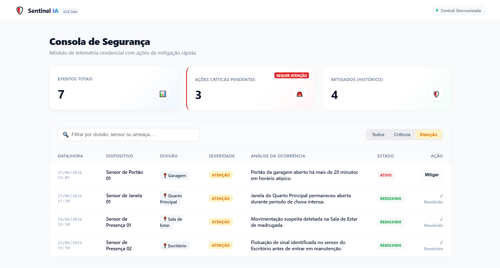
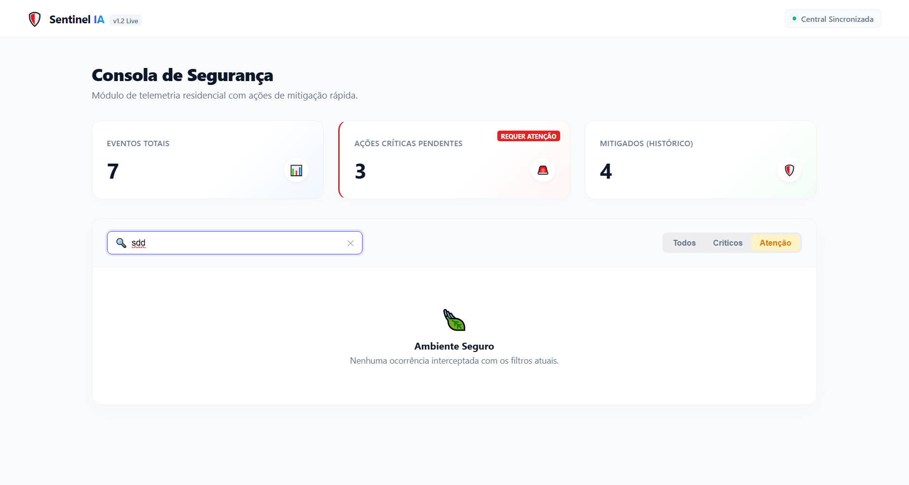
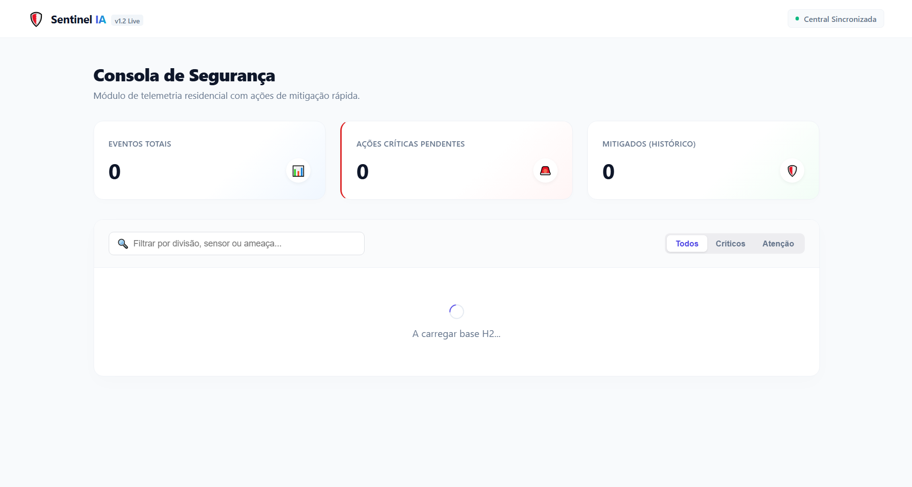

# Sentinel IA

# 🛡️ Sentinel IA — Consola de Segurança Inteligente

O **Sentinel IA** é um ecossistema de monitorização residencial em tempo real projetado para centralizar a telemetria de dispositivos IoT e sensores de segurança. Esta aplicação fornece uma interface analítica de alta performance para a mitigação rápida de ameaças domésticas.

---

## 🚀 Tecnologias Utilizadas

O projeto foi construído utilizando uma arquitetura desacoplada modernas, dividida em duas camadas principais:

### ⚙️ Backend (Motor Core)
* **Java 21**: Linguagem base para alto desempenho e tipagem segura.
* **Spring Boot 3.3+**: Framework para construção da API RESTful de forma ágil.
* **Spring Data JPA**: Abstração de persistência e comunicação com a base de dados.
* **H2 Database Engine**: Banco de dados relacional temporário executado inteiramente **em memória (RAM)**, ideal para validação rápida do MVP.
* **Lombok**: Automatização de boilerplate code (Getters, Setters, Construtores).

### 🎨 Frontend (Interface Premium)
* **React**: Biblioteca Javascript para interfaces reativas por componentes.
* **CSS3 Custom Properties**: Design moderno com variáveis e animações fluidas inspiradas no ecossistema de grandes empresas de tech (Stripe/Linear/Vercel).

---

## 📋 Funcionalidades do MVP

* **Métricas em Tempo Real:** Painel com contadores dinâmicos calculados diretamente a partir dos dados do H2.
* **Filtros por Segmentação:** Visualização isolada de alertas por severidade (*Todos*, *Críticos* ou *Atenção*).
* **Barra de Pesquisa Funcional:** Filtragem instantânea baseada em texto para divisões, nomes de sensores ou descrição de ocorrências.
* **Ações de Mitigação:** Botão interativo que altera o estado do alerta localmente, simulando a resolução de uma brecha de segurança.
* **Carga de Dados Automática (Mock):** O banco H2 é populado automaticamente com cenários reais assim que o servidor inicializa.

---

## 🛠️ Como Executar o Projeto Localmente

Certifique-se de ter o **Java 21** e o **Node.js (LTS)** instalados na sua máquina.